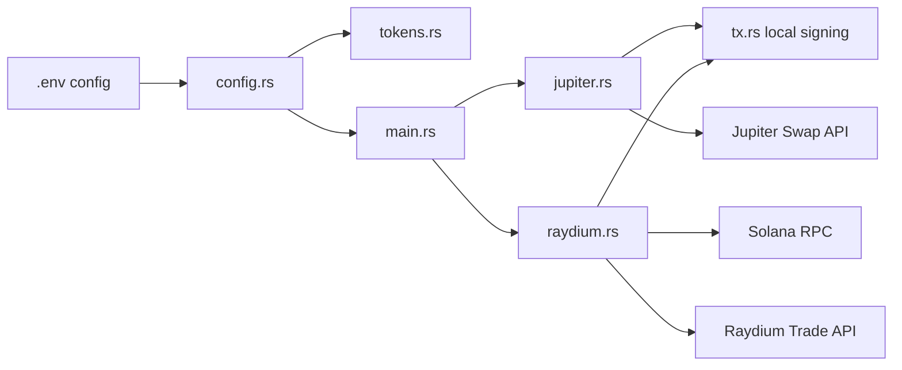
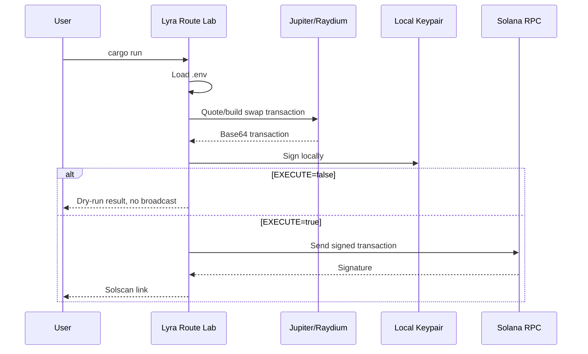
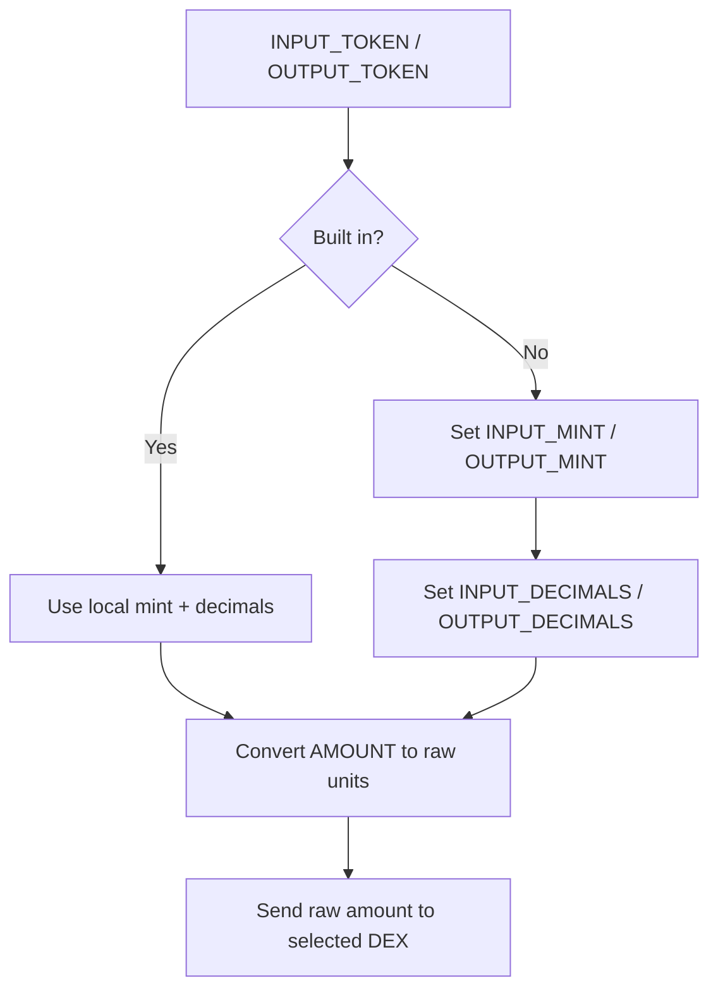
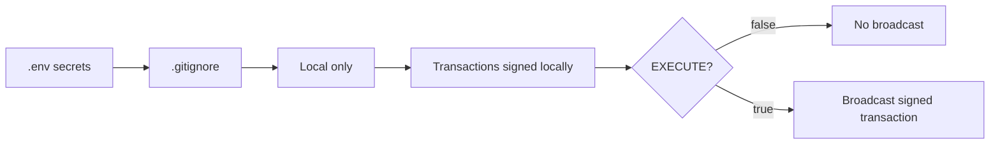

# Lyra Route Lab

Rust CLI for researching and executing Solana DEX routes through Jupiter or Raydium. It is designed as a small, inspectable base for route experiments: configurable tokens, local transaction signing, dry-run first, and separate DEX modules.


## Overview



## Execution Flow



## Modules

| File | Role |
| --- | --- |
| `src/main.rs` | Entry point. Loads config and dispatches to the selected DEX. |
| `src/config.rs` | Reads `.env`, loads wallet, validates DEX selection. |
| `src/jupiter.rs` | Jupiter `/order` and `/execute` flow. |
| `src/raydium.rs` | Raydium quote, transaction build, and RPC send flow. |
| `src/tokens.rs` | Token symbol registry and decimal amount conversion. |
| `src/tx.rs` | Base64 transaction decoding, local signing, and RPC send. |
| `src/http.rs` | Shared HTTP JSON response parsing. |

## Configure

Copy `.env.example` to `.env`, then edit the values:

```dotenv
DEX=raydium

JUPITER_API_KEY=your_jupiter_api_key
JUPITER_BASE_URL=https://api.jup.ag/swap/v2
RAYDIUM_BASE_URL=https://transaction-v1.raydium.io
RPC_URL=https://api.mainnet-beta.solana.com

INPUT_TOKEN=SOL
OUTPUT_TOKEN=USDC
AMOUNT=0.1
# AMOUNT_RAW=100000000

# For tokens not built into the local registry, use mint + decimals:
# INPUT_MINT=So11111111111111111111111111111111111111112
# INPUT_DECIMALS=9
# OUTPUT_MINT=EPjFWdd5AufqSSqeM2qN1xzybapC8G4wEGGkZwyTDt1v
# OUTPUT_DECIMALS=6

SLIPPAGE_BPS=50
TX_VERSION=V0
COMPUTE_UNIT_PRICE_MICRO_LAMPORTS=50000

BS58_PRIVATE_KEY=your_base58_encoded_private_key
# SOLANA_KEYPAIR_PATH=/Users/masion/.config/solana/id.json

EXECUTE=false
```

## Token Selection



Built-in symbols:

| Symbol | Decimals |
| --- | ---: |
| `SOL` | 9 |
| `USDC` | 6 |
| `USDT` | 6 |
| `RAY` | 6 |
| `JUP` | 6 |

`AMOUNT=0.1` is converted using the input token decimals. Use `AMOUNT_RAW` when exact raw units are needed; `AMOUNT_RAW` takes priority over `AMOUNT`.

## DEX Selection

| Value | Integration |
| --- | --- |
| `DEX=raydium` | Raydium Trade API. Builds signed-ready transactions and sends them through `RPC_URL` only when execution is enabled. |
| `DEX=jupiter` | Jupiter Swap API. Uses Jupiter order/execute flow. Requires `JUPITER_API_KEY`. |

## Run

Dry-run first. This builds and signs the transaction locally, but does not broadcast:

```bash
cargo run
```

Submit once without changing `.env`:

```bash
cargo run -- --execute
```

Or enable execution in `.env`:

```dotenv
EXECUTE=true
```

Then run:

```bash
cargo run
```

## Safety Notes



- `.env` is ignored by Git and should contain private keys/API keys only locally.
- `EXECUTE=false` is the default safe mode.
- `BS58_PRIVATE_KEY` takes priority over `SOLANA_KEYPAIR_PATH` when both are set.
- `BS58_PRIVATE_KEY` can be either a 64-byte Solana keypair or a 32-byte seed encoded as base58.
